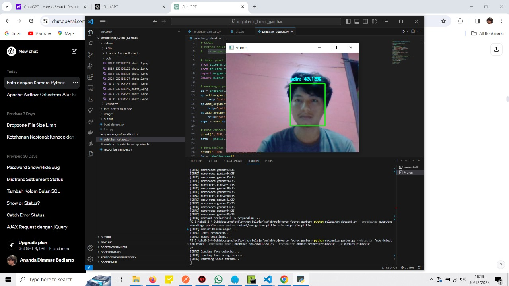

cara pakai :

python buat_dataset.py --dataset dataset --embeddings output/embeddings.pickle --detector face_detection_model --embedding-model openface_nn4.small2.v1.t7

python pelatihan_dataset.py --embeddings output/embeddings.pickle --recognizer output/recognizer.pickle --le output/le.pickle

python recognize_gambar.py --detector face_detection_model --embedding-model openface_nn4.small2.v1.t7 --recognizer output/recognizer.pickle --le output/le.pickle

camera : saya pakai camera exsternal

